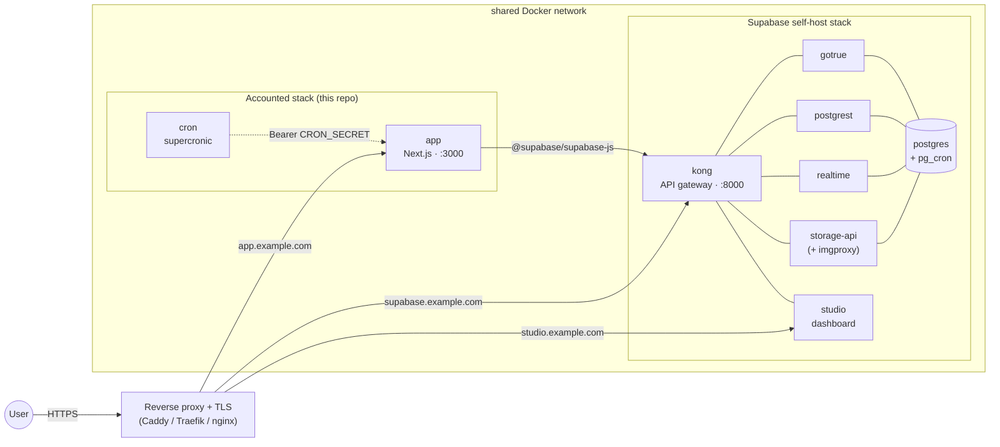

# Self-Hosting Accounted

This guide walks you through deploying Accounted on your own infrastructure using Docker.

## Prerequisites

- Docker and Docker Compose v2+
- A Supabase project (free tier works: create one at [supabase.com](https://supabase.com))

## 1. Create a Supabase Project

1. Go to [supabase.com](https://supabase.com) and create a new project.
2. Note these values from **Settings > API**:
   - `Project URL` (e.g., `https://abcdefgh.supabase.co`)
   - `anon` public key
   - `service_role` secret key

## 2. Configure Supabase Auth

In the Supabase dashboard under **Authentication > URL Configuration**:

1. Set **Site URL** to your deployment URL (e.g., `https://gnubok.example.com`).
2. Add `https://gnubok.example.com/auth/callback` to the **Redirect URLs** allowlist.

Accounted uses email + password authentication with magic link as a fallback. The default Supabase email auth settings work out of the box. For production, configure a custom SMTP provider under **Authentication > SMTP Settings** to avoid Supabase's built-in rate limits.

MFA (two-factor authentication via TOTP) is **not enforced** for self-hosted deployments: the Docker image sets `NEXT_PUBLIC_SELF_HOSTED=true` by default, which disables MFA enforcement. Users can still optionally enable 2FA in Settings > Säkerhet if they wish. Idle and absolute session timeouts are also off by default for self-hosted installs; operators can opt in with the variables below.

## 3. Apply Database Migrations

The `supabase/migrations/` directory contains the ordered SQL files that set up the full schema, including tables, RLS policies, triggers, and functions.

**Option A: Supabase CLI (recommended):**

```bash
# Install the Supabase CLI
npm install -g supabase

# Link to your project
supabase link --project-ref <your-project-ref>

# Push all migrations
supabase db push
```

**Option B: SQL Editor:**

Run each file in `supabase/migrations/` in order in the Supabase SQL Editor. They must be applied sequentially: later migrations depend on earlier ones.

### PostgreSQL Extensions

The migrations automatically enable these extensions:

| Extension | Migration | Purpose |
|-----------|-----------|---------|
| `uuid-ossp` | 001 | UUID generation |
| `vector` (pgvector) | 033 | AI embedding storage (for AI extensions) |
| `btree_gist` | 042 | Fiscal period overlap prevention |
| `pg_cron` | 048 | In-database scheduled jobs |

These are all available on Supabase hosted. `pg_cron` requires a paid plan: if you are on the free tier, migration 048 will fail. You can safely skip it; the cron sidecar container handles the equivalent job via HTTP instead.

## 4. Configure Environment

**Option A: Setup script (recommended):**

```bash
git clone https://github.com/erp-mafia/gnubok.git
cd Accounted
./setup.sh
```

The script checks prerequisites, prompts for your Supabase credentials, auto-generates `CRON_SECRET`, and writes everything to `.env`.

**Option B: Manual:**

```bash
git clone https://github.com/erp-mafia/gnubok.git
cd Accounted
cp .env.docker.example .env
```

Edit `.env` with your values:

```bash
# ─── Required ───
NEXT_PUBLIC_SUPABASE_URL=https://your-project.supabase.co
NEXT_PUBLIC_SUPABASE_ANON_KEY=your-anon-key
SUPABASE_SERVICE_ROLE_KEY=your-service-role-key
NEXT_PUBLIC_APP_URL=https://your-domain.com
CRON_SECRET=<generate with: openssl rand -hex 32>
```

`NEXT_PUBLIC_APP_URL` must match your public-facing URL. It is used in invoice reminder emails, calendar feed links, and PSD2 callbacks. If left as a placeholder, links will be broken.

Automatic logout is opt-in per user: sessions only expire for users who have
enabled "Automatic logout" in Settings > Security (stored on
`user_preferences.auto_logout`, default off). For opted-in users, hosted
Accounted defaults to a 30-minute idle limit, a 12-hour absolute limit, and a
warning 2 minutes before expiry. Self-hosted installations leave both limits
disabled unless you opt in (values are milliseconds):

```bash
NEXT_PUBLIC_SESSION_IDLE_TIMEOUT_MS=1800000
NEXT_PUBLIC_SESSION_ABSOLUTE_TIMEOUT_MS=43200000
NEXT_PUBLIC_SESSION_WARNING_MS=120000
```

Set either timeout to `0` to disable only that limit. To enforce the timeouts
for every user regardless of their per-user preference (the pre-2026-08
behavior), also set:

```bash
NEXT_PUBLIC_SESSION_TIMEOUT_FORCE_ALL=true
```

Timeout state is signed
with `SUPABASE_SERVICE_ROLE_KEY` by default; set `SESSION_TIMEOUT_SECRET` to a
separate random value if you want to rotate it independently. Changing either
signing secret invalidates existing timeout cookies and requires users to sign
in again.

## 5. Start the Application

```bash
docker compose up -d
```

This starts two containers:

| Container | Purpose |
|-----------|---------|
| `app` | Next.js application (`ghcr.io/erp-mafia/gnubok:latest`) |
| `cron` | Scheduled jobs via [supercronic](https://github.com/aptible/supercronic) |

The cron container waits for the app health check to pass before starting.

Verify the deployment:

```bash
curl http://localhost:3000/api/health
# {"status":"healthy","timestamp":"...","version":"1.0.0"}
```

> **Note:** The health check queries the database, so migrations must be applied before it returns healthy.

### Building from Source

To build the Docker image locally instead of pulling from GHCR:

```bash
docker compose -f docker-compose.yml -f docker-compose.build.yml up --build
```

The locally-built image runs **unprivileged** (`USER nextjs`): the entrypoint
populates the `.next`/`public` tmpfs mounts and substitutes the `NEXT_PUBLIC_*`
placeholders as the `nextjs` user, so the container needs no Linux capabilities
and runs as-is under the hardened compose defaults (`cap_drop: ALL`,
`read_only: true`).

### Custom Port

Set `PORT` in your `.env` or environment to change the host port (the container always listens on 3000 internally):

```bash
PORT=8080 docker compose up -d
```

## 6. First Login

1. Open your deployment URL in a browser.
2. Click "Skapa konto" (Create account) and register with email + password.
3. Check your email and click the confirmation link.
4. Complete the 5-step onboarding wizard:
   - **Step 1**: Choose entity type (enskild firma or aktiebolag)
   - **Step 2**: Company name and org number
   - **Step 3**: Fiscal year, VAT registration, accounting method
   - **Step 4**: Preliminary tax amount (optional, skip if unsure)
   - **Step 5**: Bank details for invoices (optional)

There is no admin account or invite system: any email address can sign up. You can also use the magic link option on the login page if preferred.

## Scheduled Jobs

The cron sidecar runs these jobs automatically:

| Schedule (UTC) | Endpoint | Purpose |
|----------------|----------|---------|
| Daily 06:00 | `/api/deadlines/status/cron` | Update deadline statuses |
| Daily 08:00 | `/api/invoices/reminders/cron` | Send overdue invoice reminders |
| Yearly Jan 2 | `/api/tax-deadlines/cron` | Generate tax deadlines for the new year |
| Sundays 03:00 | `/api/documents/verify/cron` | SHA-256 integrity check on document archive |

All cron endpoints are authenticated with `Authorization: Bearer <CRON_SECRET>`. The cron container calls the app over the internal Docker network (`http://app:3000`), so these endpoints are not exposed publicly.

Additionally, migration 048 schedules a `pg_cron` job inside the database that marks overdue supplier invoices daily at 06:00 UTC.

## Optional Features

### AI Features

All AI features (automatic interpretation of uploaded receipts and invoices via the `document-extraction` and `invoice-inbox` extensions, and the in-app AI assistant) run on one configured backend. There are three ways to provide one; pick one. Note that the agent surface most integrations use, the MCP server, needs no AI backend at all: it is your own agent (Claude, Codex, a local model) talking to the ledger, so a deployment without any of the credentials below is still fully usable that way.

The stock self-hosted image includes both extraction extensions, so these credentials cover emailed invoices and documents uploaded in the app.

**Option 1: the direct Anthropic API.** The simplest option for self-hosting, since it needs nothing but a key from [console.anthropic.com](https://console.anthropic.com). Billing is your own, separate from any Claude subscription.

```bash
ANTHROPIC_API_KEY=sk-ant-...
```

**Option 2: AWS Bedrock.** Requires an AWS account with Bedrock model access to Claude. This is what the hosted service runs, because it keeps inference inside eu-north-1: choose it if you need the AI calls to stay in the EU, which the direct API does not guarantee.

```bash
AWS_ACCESS_KEY_ID=...
AWS_SECRET_ACCESS_KEY=...
AWS_REGION=eu-north-1   # default
```

Set both static AWS keys explicitly. The AI assistant's client can fall back to the standard AWS credential provider chain (instance profile, IRSA) when they are absent, but document extraction requires `AWS_ACCESS_KEY_ID` and `AWS_SECRET_ACCESS_KEY` and silently returns empty results without them.

**Option 3: any OpenAI-compatible endpoint.** Any server that implements the chat-completions API: a Swedish inference provider for a fully sovereign deployment, or a **local model** on the same machine (llama.cpp's `server`, Ollama's `/v1`, LM Studio, vLLM). Document extraction (receipts, invoices, HTML mail invoices), the assistant's question-and-answer (on both `/chat` and the docked assistant sheet, via `/api/agent/ask`), and one-tap transaction categorization run here on any provider. A set of specialized conversational flows still needs an Anthropic-family backend; see **What runs on any model** below.

```bash
AI_BASE_URL=http://localhost:11434/v1   # the endpoint's OpenAI-compatible base URL (here: a local Ollama)
AI_MODEL=qwen3.8                        # a model id is required: there is no default for an arbitrary endpoint
# AI_API_KEY=...                        # OPTIONAL: only when the endpoint needs auth. A local server usually
#                                       #   has none, so leave it unset; a hosted provider gives you a key.
# AI_EXTRACTION_MODEL=...               # optional: a vision model for document reading, if AI_MODEL is not one
```

Three things about such endpoints are declared rather than probed, because the app cannot tell from the outside:

- `AI_VISION=false` says the configured model cannot read images. Images and PDFs are then skipped honestly (the inbox row lands with the empty skeleton and the "AI-tolkning kördes inte" hint) instead of failing with a 400 on every upload; HTML mail invoices still extract as text on any model.
- `AI_PDF_MODE` defaults to `rasterize` here: most such endpoints have no PDF input, so the first `AI_PDF_MAX_PAGES` pages (default 4) are rendered to images with poppler's `pdftoppm`, which the self-host image installs (`apk add poppler-utils`, the only system package beyond the base image; page images are written to `/tmp`, a tmpfs in `docker-compose.yml`). If the binary is missing, PDFs are skipped with `pdf_rasterizer_missing` rather than failing; `AI_PDF_RASTERIZER_BIN` points at a non-standard install. A provider that accepts the OpenAI `file` content part can use `AI_PDF_MODE=native`.
- `AI_STRICT_JSON=true` asks for `response_format: json_schema` on providers that enforce it. The default (JSON answered in prose, then parsed and validated) works on every model and is what hosted runs.

#### What runs on any model

Most AI surfaces run on any of the three backends above, an OpenAI-compatible or local model included:

- **Document extraction**: receipts, invoices, and HTML mail invoices.
- **The AI assistant's question-and-answer**, on both `/chat` and the docked assistant sheet (`/api/agent/ask`), including its read-only ledger tools.
- **One-tap transaction categorization** (`/api/agent/categorize`): the deterministic-candidates then model-select cascade shown on the transactions page.

A few **specialized conversational flows** still run on the older streaming runtime (`/api/agent/invoke`), which requires an Anthropic-family model (AWS Bedrock or the direct Anthropic API). On an OpenAI-compatible or local backend these specific actions return `503`; everything above keeps working. They are:

- **Operation-staging flows** (they draft a change for you to approve): the invoice-inbox "Fraga assistenten" categorize, bulk-book, invoice draft, supplier-invoice review, and verifikat draft.
- **Context-bound assistant helpers**: VAT review, KPI explanation, settings help, the bokslut step-through, and onboarding.

Migrating these to the single-call surface, so a fully local deployment covers them too, is tracked in [#1800](https://github.com/erp-mafia/accounted/issues/1800).

Optional model overrides, in any setup:

```bash
AI_MODEL=...                             # default model for every tier (OpenAI-compatible: required)
AI_EXTRACTION_MODEL=...                  # document extraction model
AI_HEAVY_MODEL=...                       # assistant model, heavy intents
AI_ASSISTANT_MODEL=...                   # assistant model, standard intents
AI_EXTRACTION_MAX_TOKENS=8192            # output cap for document extraction
AI_PROVIDER=bedrock|anthropic|openai-compatible   # force the backend (see below)
```

The pre-existing names `BEDROCK_MODEL_ID`, `BEDROCK_OPUS_MODEL_ID`, `BEDROCK_SONNET_MODEL_ID` and `BEDROCK_MAX_TOKENS` keep working as the same overrides (extraction, heavy, standard, extraction cap) on every backend; the `AI_*` names take precedence when both are set. Claude deployments default every tier to `claude-sonnet-5`.

When several credential sets are present, Bedrock wins, then the direct Anthropic API, then the OpenAI-compatible endpoint, so that adding a key for an experiment cannot silently move production inference out of eu-north-1. Set `AI_PROVIDER` to say which you mean. A model id written without a provider prefix is adapted to whichever backend is active; an id that already carries one (`eu.anthropic.…`) is used as-is.

Without working credentials the rest of the app runs normally: uploads are stored but not auto-interpreted (the upload UI sees that immediately rather than waiting for a timeout), and the AI assistant answers `503 ai_unconfigured`.

#### Verifying the setup

`scripts/smoke-ai-provider.ts` is the "is AI wired up?" command. It works the same on every backend because it only talks to the app's AI service: it prints the resolved provider, the model per tier, the PDF mode (and whether `pdftoppm` is installed when PDFs are rasterized), then sends real traffic: one small text generation per tier model, one schema-shaped answer, and, when you pass a file, the exact document-extraction path an uploaded receipt takes. It exits non-zero if any step fails, so it works as a post-deploy check. Run it from a checkout next to the env file your deployment uses (`.env.local`, then `.env` are read):

```bash
npx tsx scripts/smoke-ai-provider.ts                 # provider, models, text + structured calls
npx tsx scripts/smoke-ai-provider.ts ./receipt.pdf   # also runs document extraction end to end
```

A skipped extraction is reported as a failure with the reason: a text-only model (`ai_no_vision`, pick a vision model for `AI_EXTRACTION_MODEL`), a missing rasterizer (`pdf_rasterizer_missing`, install poppler-utils or set `AI_PDF_MODE=native`), or no credentials/model at all.

On the Anthropic family, `scripts/smoke-ai.ts` additionally probes the in-app assistant's full parameter set (a streamed turn with a tool, adaptive thinking, effort and the prompt cache), which the assistant still sends through the Anthropic SDK directly:

```bash
npx tsx scripts/smoke-ai.ts                  # credentials, models, chat loop
# Note: this check only detects static credentials (ANTHROPIC_API_KEY or
# AWS_ACCESS_KEY_ID/AWS_SECRET_ACCESS_KEY). Bedrock deployments using an
# instance profile or IRSA won't be picked up automatically: set
# AI_PROVIDER=bedrock to run the probes against the AWS credential chain
# anyway.
npx tsx scripts/smoke-ai.ts ./receipt.pdf    # also runs document extraction
```

> **Note:** `OPENAI_API_KEY` from earlier versions is not read by any code path. To use OpenAI itself, point Option 3 at `https://api.openai.com/v1`; the app has no provider-specific OpenAI integration, only the OpenAI-compatible one. Background: [#1406](https://github.com/erp-mafia/accounted/issues/1406).

### Email (Invoice Sending and Reminders)

Outbound mail (invoices, reminders, payslips) goes through one of two providers. Auth/account mail is sent by Supabase Auth and is not affected.

**Option 1: Resend** (what hosted runs):

```bash
RESEND_API_KEY=re_...
RESEND_FROM_EMAIL=noreply@your-domain.com
```

Requires a [Resend](https://resend.com) account with a verified sender domain.

**Option 2: your own SMTP relay** (a Swedish mail provider, a Microsoft 365 / Google Workspace relay, Postfix on the host):

```bash
EMAIL_PROVIDER=smtp
SMTP_HOST=smtp.example.se
SMTP_PORT=587                         # default 587; 465 with SMTP_SECURE=true
SMTP_SECURE=false                     # true = implicit TLS, false = STARTTLS
SMTP_USER=...                         # optional for an internal relay
SMTP_PASS=...
SMTP_FROM_EMAIL=faktura@your-domain.se
# SMTP_TLS_REJECT_UNAUTHORIZED=false  # only for a LAN relay with a self-signed certificate
```

`EMAIL_PROVIDER` is optional: with a `RESEND_API_KEY` present Resend is used, otherwise `SMTP_HOST` selects SMTP, so adding SMTP variables next to an existing Resend key never moves mail by accident. Set it explicitly when both are configured. The From header is built the same way on both providers (`<sender name> via <app name> <from address>`), and the delivery-status webhook is Resend-only.

Without either, invoices can still be generated as PDFs but cannot be emailed.

### Push Notifications

```bash
NEXT_PUBLIC_VAPID_PUBLIC_KEY=...
VAPID_PRIVATE_KEY=...
VAPID_SUBJECT=mailto:you@example.com
```

Generate VAPID keys with `npx web-push generate-vapid-keys`. Push notifications require HTTPS.

### Error Tracking (Sentry)

```bash
SENTRY_DSN=https://...@sentry.io/...
NEXT_PUBLIC_SENTRY_DSN=https://...@sentry.io/...
```

Sentry is disabled if these are not set. No errors are thrown.

## Storage Buckets

Migration 024 automatically creates the `documents` storage bucket (private, 50 MB limit, WORM, no update/delete). No other buckets need to be created manually.

## Updating

Pull the latest image and restart:

```bash
docker compose pull
docker compose up -d
```

If a new release includes database migrations, apply them before restarting:

```bash
supabase db push
```

Check the [release notes](https://github.com/erp-mafia/gnubok/releases) for migration instructions.

## Architecture Overview

```
┌─────────────────────┐     ┌──────────────────┐
│   Docker: app       │     │  Docker: cron     │
│   (Next.js)         │◄────│  (supercronic)    │
│   Port 3000         │     │  Bearer auth      │
└────────┬────────────┘     └──────────────────┘
         │
         │ HTTPS
         ▼
┌─────────────────────┐
│  Supabase           │
│  - PostgreSQL + RLS │
│  - Auth (email+pw)  │
│  - Storage (docs)   │
└─────────────────────┘
```

The Next.js app is stateless: all data lives in Supabase. The Docker entrypoint injects your `NEXT_PUBLIC_*` environment variables into the pre-built JS bundles at container startup, so a single image works with any Supabase project.

## Fully Self-Hosted (No Supabase Cloud)

The setup above relies on a Supabase project at supabase.com. If you also want to host the database, auth, and storage yourself (to keep all data on-premises, avoid the SaaS dependency, or run air-gapped) you can pair Accounted with [Supabase's official Docker self-hosting stack](https://supabase.com/docs/guides/self-hosting/docker) instead.

This is a more involved path. You take responsibility for backups, TLS certificates, image upgrades, and Postgres operations. It is intended for operators already running Docker services who are comfortable with PostgreSQL.

### Architecture



### Setup outline

1. **Bring up Supabase** following [supabase.com/docs/guides/self-hosting/docker](https://supabase.com/docs/guides/self-hosting/docker). Generate your own `JWT_SECRET`, `ANON_KEY`, and `SERVICE_ROLE_KEY` (Supabase ships `sh utils/generate-keys.sh`). Pick a hostname for the API gateway (e.g. `supabase.example.com`) and point `SUPABASE_PUBLIC_URL` / `API_EXTERNAL_URL` at it.

2. **Apply the Accounted migrations** directly via `psql`: the Supabase CLI (`db push`) assumes a cloud project, so run the SQL files against the self-hosted database container:

   ```bash
   # From the repo root, stream each migration straight into the supabase-db
   # container: glob order is already sorted, and nothing is left behind on the
   # host or in the container.
   for f in supabase/migrations/*.sql; do
     echo "Applying $f..."
     docker exec -i supabase-db psql -v ON_ERROR_STOP=1 -U postgres -d postgres < "$f" || exit 1
   done
   ```

3. **Configure `.env`** with your self-hosted endpoints (extract the keys from your Supabase `.env`):

   ```bash
   NEXT_PUBLIC_SUPABASE_URL=https://supabase.example.com
   NEXT_PUBLIC_SUPABASE_ANON_KEY=<ANON_KEY from supabase .env>
   SUPABASE_SERVICE_ROLE_KEY=<SERVICE_ROLE_KEY from supabase .env>
   NEXT_PUBLIC_APP_URL=https://app.example.com
   CRON_SECRET=<openssl rand -hex 32>
   NEXT_PUBLIC_SELF_HOSTED=true
   ```

4. **Allowlist the callback URLs** in GoTrue's redirect list (the Supabase stack's `.env`), then recreate the auth container so it picks up the change:

   ```bash
   ADDITIONAL_REDIRECT_URLS=https://app.example.com/auth/callback,https://app.example.com/api/auth/callback
   ```
   ```bash
   cd <your-supabase-dir> && docker compose up -d auth
   ```

5. **Reverse proxy** in front of both hosts. The app container and the Supabase `kong` container must share an external Docker network so the proxy can route to them by name.

### Synology DSM and Xpenology notes

Run Accounted and Supabase as two separate Container Manager Projects with two
separate project directories. Accounted owns the Compose files in this
repository. Supabase owns its database, Auth, Realtime, Storage, and pooler
configuration. Choose one upstream release tag or full commit and copy the
complete `docker/` directory from that immutable revision, following the
[official Supabase Docker guide](https://supabase.com/docs/guides/self-hosting/docker).
Do not copy individual snippets into Accounted's Compose file or mix files from
different upstream revisions.

For the **Accounted project**, follow the
[Accounted Container Manager file layout](DOCKER.md#synology-dsm-and-xpenology).
For the **Supabase project**:

1. Copy the entire upstream `supabase/docker/` directory into the project
   directory. Do not upload only its `docker-compose.yml`: it bind-mounts SQL,
   gateway, function, pooler, and Storage files from the accompanying
   `volumes/` tree.
2. Create the two runtime directories that upstream deliberately excludes from
   Git before the first deployment. File Station is fine, or from the Supabase
   project directory use:

   ```bash
   mkdir -p volumes/db/data volumes/storage
   ```

   Container Manager must be able to write to both directories. Use the
   narrowest NAS ACL that works for the container runtime; do not make the
   whole shared folder world-writable.
3. Supavisor publishes two host ports. Before starting the project, make sure
   both `POSTGRES_PORT` and `POOLER_PROXY_PORT_TRANSACTION` in the **Supabase**
   `.env` are unused on the NAS. If the defaults conflict, examples are
   `POSTGRES_PORT=5433` for session mode and
   `POOLER_PROXY_PORT_TRANSACTION=6544` for transaction mode. Changing only
   `POSTGRES_PORT` does not resolve a conflict on the transaction port.
   Accounted's `PORT` only changes the web app port and cannot resolve either
   database conflict. Do not expose the Supabase `db` container directly just
   to solve a conflict: the official stack exposes PostgreSQL through
   Supavisor.

   Supabase's default Supavisor port mappings listen on every host interface.
   Accounted does not need either database port over the network, so on a
   shared NAS bind both mappings to loopback in the version-matched Supabase
   Compose file:

   ```yaml
   services:
     supavisor:
       ports:
         - "127.0.0.1:${POSTGRES_PORT}:5432"
         - "127.0.0.1:${POOLER_PROXY_PORT_TRANSACTION}:6543"
   ```

   If another trusted machine must connect, bind to a specific private NAS
   address and restrict both ports to trusted source addresses in the DSM
   firewall. Never forward either database port to the public internet.
4. The default Accounted integration uses Supabase's legacy `ANON_KEY` and
   `SERVICE_ROLE_KEY`, so asymmetric keys and `JWT_JWKS` are optional. Leave
   the upstream JWKS lines commented when using legacy-only mode. If you enable
   Supabase's new asymmetric keys, generate them with the upstream
   `utils/add-new-auth-keys.sh` script and follow the
   [official authentication-key guide](https://supabase.com/docs/guides/self-hosting/self-hosted-auth-keys).

Some older Compose parsers reject the inline JSON fallback in Supabase's
optional Realtime setting:

```yaml
API_JWT_JWKS: ${JWT_JWKS:-{"keys":[]}}
```

After `JWT_JWKS` has been generated and saved in the Supabase `.env`, use the
direct substitution documented by Supabase for limited Compose parsers:

```yaml
# Supabase PostgREST
PGRST_JWT_SECRET: ${JWT_JWKS}

# Supabase Realtime
API_JWT_JWKS: ${JWT_JWKS}

# Supabase Storage
JWT_JWKS: ${JWT_JWKS}
```

Do not invent an empty or placeholder JWKS for a production deployment. Either
keep asymmetric authentication disabled or configure the generated value
consistently for every Supabase service that verifies tokens.

Accounted's base Compose file intentionally omits the optional `cpus` and
`healthcheck.start_interval` settings because older Container Manager Compose
builds can reject them. Operators who need a CPU cap can set one through DSM's
resource controls or a local Compose override. Existing deployments that
relied on the previous two-CPU cap must reapply it before restarting with the
new base file. Command-line deployments on Docker Compose 2.20.2 or newer and
Docker Engine 25.0 or newer can use the version-controlled
`docker-compose.resources.yml` overlay to restore both the cap and faster
startup health checks; older NAS container stacks should keep using the
portable base file alone.

### What you give up vs. cloud Supabase

- **Backups** are entirely your responsibility: set up `pg_dump` (or a tool like restic) to off-host storage. As a portable, vendor-neutral *logical* backup on top of the raw dump, you can also export each fiscal period as a standard **SIE4** file via the API and archive it: any Swedish bookkeeping system can re-import it:

  ```bash
  curl -fsS -H "Authorization: Bearer <reports:read API key>" \
    "$NEXT_PUBLIC_APP_URL/api/v1/companies/<companyId>/reports/sie-export?period_id=<periodId>" \
    -o "export_<periodId>.se"
  ```
- **Storage**: the included `storage-api` defaults to the local-filesystem backend. For production durability, use the `docker-compose.s3.yml` overlay and point it at S3 / MinIO.
- **SMTP**: no built-in mailer. Either set `ENABLE_EMAIL_AUTOCONFIRM=true` for dev/staging, or wire `SMTP_*` env vars in the Supabase stack to a provider (Resend, Postmark, etc.).
- **Upgrades**: you sync the `supabase/postgres` image yourself; your data lives in the DB volume, so a Postgres image bump needs no migration re-run. When you pull a newer Accounted release, apply only the **new** migration files added since your last deploy (the SQL is not idempotent, so re-running already-applied migrations will error). Track which migrations you've applied, e.g. with a checksum/version table.

### Notes

- **`pg_cron`** is included in the `supabase/postgres` image, so the `pg_cron` migration succeeds (unlike on the Supabase free tier, see the standard self-hosting flow above).
- **MFA**: as on the standard path, `NEXT_PUBLIC_SELF_HOSTED=true` disables enforcement; users may still enable TOTP voluntarily.

## Troubleshooting

**Health check fails with "unhealthy":**
Migrations have not been applied, or the Supabase credentials are wrong. Check that `NEXT_PUBLIC_SUPABASE_URL` and `SUPABASE_SERVICE_ROLE_KEY` are correct and that migrations have been pushed.

**Confirmation email not arriving:**
Check the Supabase dashboard under **Authentication > Users** to verify the signup attempt was received. On the free tier, Supabase rate-limits emails to 4/hour. Configure custom SMTP under **Authentication > SMTP Settings** for production use.

**Auth callback redirects to error:**
Ensure `https://your-domain.com/auth/callback` is in the Supabase **Redirect URLs** allowlist and that **Site URL** matches your `NEXT_PUBLIC_APP_URL`.

**`pg_cron` migration fails:**
`pg_cron` requires a paid Supabase plan. On the free tier, you can safely comment out migration 048 or let it fail: the overdue supplier invoice check is non-critical and can be triggered manually.

**Container restarts in a loop:**
Check logs with `docker compose logs app`. The app requires all five core env vars (`NEXT_PUBLIC_SUPABASE_URL`, `NEXT_PUBLIC_SUPABASE_ANON_KEY`, `SUPABASE_SERVICE_ROLE_KEY`, `NEXT_PUBLIC_APP_URL`, `CRON_SECRET`) and will crash on startup if any are missing.
